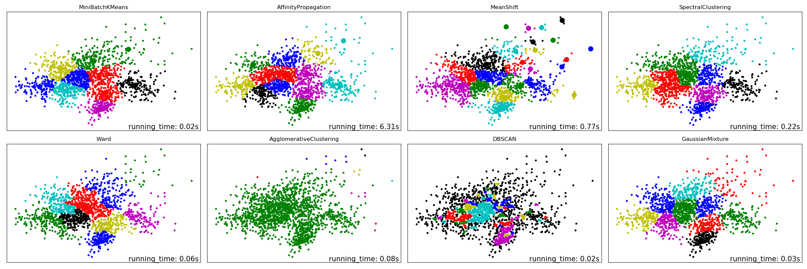

# README


## 1. clusters for digit

Code: 

  clusters_for_digits.py -> clustering algorithms for the digit dataset and their performance evaluation
  
  figures_for_digits.py -> drawing to display for the result
  
  GaussianHelper.py -> a helper for GaussianMixture(@Zhao Yue)

Output for clusters_for_digit.py：

```
=========== ========================================================
date: 2019/09/25
author: zhu li
=========== ========================================================
Shorthand    full name
--------------------------------------------------------------------
nor     Normalized Mutual Information
homo    Homogeneity
comp    Completeness
--------------------------------------------------------------------
ten_means   MiniBatchKMeans
AffinityPro     AffinityPropagation
MeanShift   MeanShift
Spectral    SpectralClustering
Ward    Ward
Agglom  AgglomerativeClustering
DBSCAN  DBSCAN

=========== ========================================================

n_digits: 10, 	 n_samples 1797, 	 n_features 64
__________________________________________________________________________________
init		time	inertia	homo	compl	v-meas	ARI-	AMI-	silhouette
k-means++	0.17s	69676	0.683	0.722	0.702	0.572	0.699	0.140
random   	0.12s	69415	0.604	0.652	0.627	0.467	0.623	0.147
PCA-based	0.03s	70769	0.669	0.696	0.683	0.558	0.679	0.147
__________________________________________________________________________________

__________________________________________________________________________________
clusters		time	inertia	nor-	homo	comp
MB_KMeans		0.02s	3034	0.444	0.437	0.452
AffinityPro		6.44s	0	0.458	0.476	0.441
MeanShift		0.77s	0	0.445	0.460	0.431
Spectral 		0.22s	0	0.461	0.459	0.462
Ward     		0.08s	0	0.451	0.444	0.458
Agglom   		0.08s	0	0.053	0.010	0.279
DBSCAN   		0.02s	0	0.308	0.316	0.301
GaussianMix		0.03s	0	0.470	0.463	0.477
__________________________________________________________________________________
```


output for figures_of_digits.py:




## clusters for document

Code:

  cluster_document.py -> clustering algorithms for the document dataset and their performance evaluation

为了加速，实验时先用了PCA和LDA(Latent Dirichlet Allocation)降维，将向量化之后的数据降到低维（2，3，4，5维）再运行算法。

print(_doc_)

```
=========== ========================================================
date: 2019/10/05
author: zhu li
=========== ========================================================
Shorthand    full name
--------------------------------------------------------------------
nor     Normalized Mutual Information
homo    Homogeneity
comp    Completeness
--------------------------------------------------------------------
ten_means   MiniBatchKMeans
AffinityPro     AffinityPropagation
MeanShift   MeanShift
Spectral    SpectralClustering
Ward    Ward
Agglom  AgglomerativeClustering
DBSCAN  DBSCAN
=========== ========================================================
```

output:

```
PCA(n_components=2):
__________________________________________________________________________________
clusters	time	inertia	norm	homo	comp
MB_KMeans	0.05s	4	0.422	0.486	0.366
AffinityPro	6.08s	0	0.411	1.000	0.169
MeanShift	0.68s	0	0.236	0.228	0.245
Spectral 	0.43s	0	0.430	0.539	0.344
Ward     	0.16s	0	0.401	0.447	0.361
Agglom   	0.14s	0	0.026	0.005	0.147
DBSCAN   	0.15s	0	0.000	0.000	1.000
GaussianMix	0.06s	0	0.431	0.490	0.378
__________________________________________________________________________________
```

```
PCA(n_components=3):
__________________________________________________________________________________
clusters	time	inertia	norm	homo	comp
MB_KMeans	0.02s	8	0.467	0.559	0.389
AffinityPro	5.81s	0	0.411	1.000	0.169
MeanShift	2.16s	0	0.240	0.215	0.269
Spectral 	0.36s	0	0.499	0.604	0.412
Ward     	0.18s	0	0.498	0.592	0.419
Agglom   	0.24s	0	0.022	0.004	0.134
DBSCAN   	0.17s	0	0.000	0.000	1.000
GaussianMix	0.09s	0	0.462	0.561	0.380
__________________________________________________________________________________
```

```
PCA(n_components=4):
__________________________________________________________________________________
clusters	time	inertia	norm	homo	comp
MB_KMeans	0.04s	14	0.452	0.544	0.375
AffinityPro	6.08s	0	0.411	1.000	0.169
MeanShift	1.53s	0	0.190	0.160	0.225
Spectral 	0.41s	0	0.517	0.620	0.431
Ward     	0.19s	0	0.489	0.577	0.416
Agglom   	0.34s	0	0.028	0.005	0.169
DBSCAN   	0.20s	0	0.000	0.000	1.000
GaussianMix	0.09s	0	0.434	0.519	0.362
__________________________________________________________________________________
```

```
PCA(n_components=5):
__________________________________________________________________________________
clusters	time	inertia	norm	homo	comp
MB_KMeans	0.02s	18	0.456	0.538	0.387
AffinityPro	6.11s	0	0.411	1.000	0.169
MeanShift	1.46s	0	0.233	0.229	0.238
Spectral 	0.42s	0	0.507	0.597	0.431
Ward     	0.22s	0	0.452	0.521	0.391
Agglom   	0.40s	0	0.030	0.005	0.170
DBSCAN   	0.21s	0	0.000	0.000	1.000
GaussianMix	0.14s	0	0.433	0.528	0.354
__________________________________________________________________________________
```

```
LatentDirichletAllocation(n_components=2):
__________________________________________________________________________________
clusters	time	inertia	norm	homo	comp
MB_KMeans	0.03s	2	0.381	0.447	0.325
AffinityPro	6.17s	0	0.411	1.000	0.169
MeanShift	0.27s	0	0.417	0.449	0.386
Spectral 	1.84s	0	0.337	0.435	0.261
Ward     	0.15s	0	0.382	0.447	0.326
Agglom   	0.11s	0	0.516	0.429	0.620
DBSCAN   	0.06s	0	0.000	0.000	1.000
GaussianMix	0.03s	0	0.391	0.448	0.342
__________________________________________________________________________________
```

==================================================================================
致谢：
  感谢赵跃同学写的GuassianHelper.py，提供了便利。让高斯混合模型可以直接和别的模型一起处理，不用单独处理了。
==================================================================================
